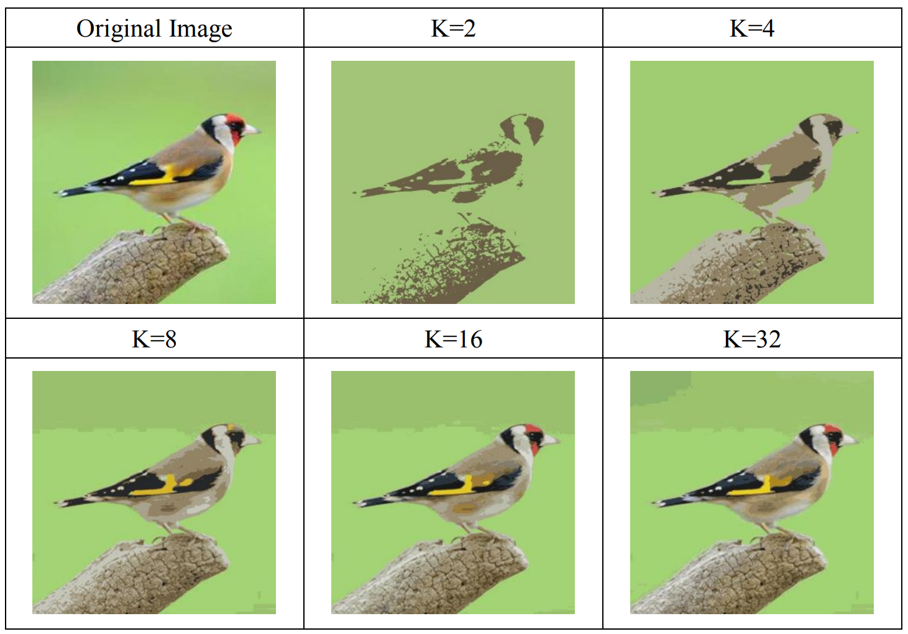
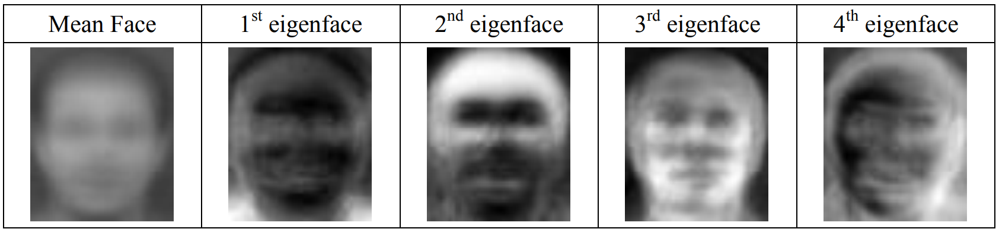
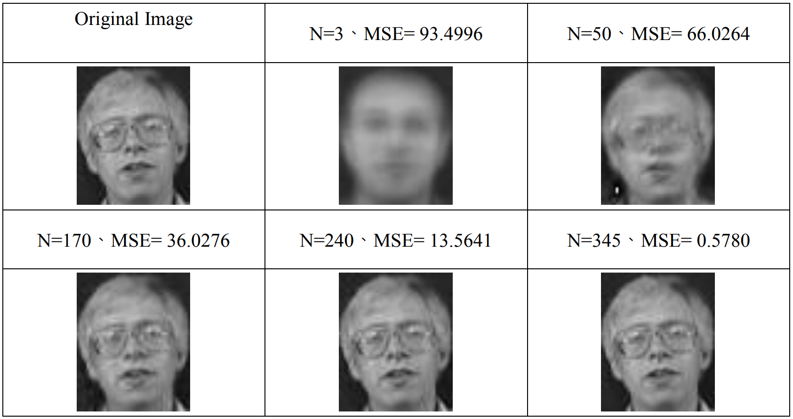

# Deep Learning for Computer Vision HW0
- There are 3 problems in HW0. I will implement K-means Clustering, Principle 
Component Analysis and Image Filtering.

- K-Means Clustering is an unsupervised learning algorithm for data grouping. In image segmentation, it can be applied to partition image pixels into different groups based on the associated pixel values or features.

- Principal component analysis (PCA) is a technique of dimensionality reduction, which linearly maps data onto a lower-dimensional space, so that the variance of the projected data in the associated dimensions would be maximized. In this problem, you will perform PCA on a dataset of face images.

- Image filtering is a basic method to smoothen or sharpen an image. The general operation of image filtering is to compute the function of local neighborhood and output the new value for each pixel of interest. For example, a 3 × 3 box filter simply replaces the value of each pixel of interest with average values of itself and its eight neighbors. For more details about image filtering, please refer to the dlcv course slides.

# Result

- Kmeans:

- PCA:

- Check hw0_report.pdf for more informations.
